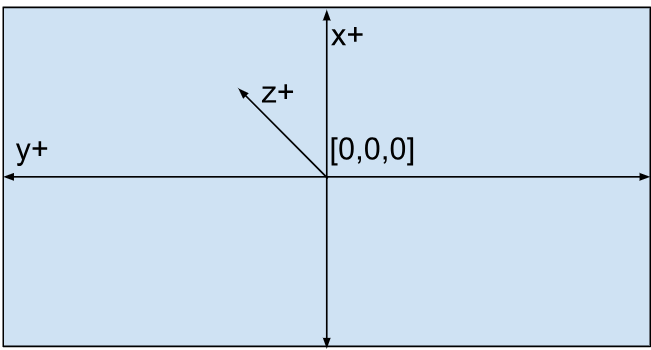

# Competitive Robot Table Tennis: Initial Ball States


## Dataset Overview

This dataset contains the initial ball states used to train the policies in the
paper [Achieving Human Level Competitive Robot Table Tennis]
(https://arxiv.org/abs/2408.03906). Each ball state represents the conditions of
the ball state immediately after it was hit by either a human or robot in the
real world. There are 15,792 ball states: 13,088 from within rallies and 2,704
from serves.

There are 4 important files:

* README.md \- This file.
* rallies.json \- Initial ball states collected from rallies in the below format.
* serves.json \- Initial ball states collected from serves in the below format.
* ball\_states\_viz.ipynb \- Notebook demonstrating how to load, roll out in MuJoCo, and visualize the initial ball states.

## Dataset Format

The data is in JSON format with the following fields:

```
'id': unique integer identifier for the ball state
'pos_x': initial x position of the ball in meters
'pos_y': initial y position of the ball in meters
'pos_z': initial z position of the ball in meters
'vel_x': initial x velocity of the ball in meters per second
'vel_y': initial y velocity of the ball in meters per second
'vel_z': initial z velocity of the ball in meters per second
'w_vel_x': initial angular x velocity of the ball in radians per second
'w_vel_y': initial angular y velocity of the ball in radians per second
'w_vel_z': initial angular z velocity of the ball in radians per second
```

The coordinate system used has \[0,0,0\] at the center of a regulation sized
table tennis table (1.525m x 2.74m x 0.76m) with x being the width of the table,
y being the length of the table, and z being the height above the table. X is
negative to the left and positive to the right when on the right hand side of
the table as shown below:



## Citing this work

This dataset is released in conjunction with the paper:

```
@inproceedings{achievinghumanlevelcompetitiveICRA2025,
      title={Achieving Human Level Competitive Robot Table Tennis},
      author={David B. D'Ambrosio and Saminda Abeyruwan and Laura Graesser and Atil Iscen and Heni Ben Amor and Alex Bewley and Barney J. Reed and Krista Reymann and Leila Takayama and Yuval Tassa and Krzysztof Choromanski and Erwin Coumans and Deepali Jain and Navdeep Jaitly and Natasha Jaques and Satoshi Kataoka and Yuheng Kuang and Nevena Lazic and Reza Mahjourian and Sherry Moore and Kenneth Oslund and Anish Shankar and Vikas Sindhwani and Vincent Vanhoucke and Grace Vesom and Peng Xu and Pannag R. Sanketi},
      booktitle    = {{IEEE} International Conference on Robotics and Automation, {ICRA}
                        2025, Atlanta, Georgia, USA May 19–23, 2025},
      publisher    = {{IEEE}},
      year         = {2025},
}
```

## License and disclaimer

Copyright 2025 Google LLC

All software is licensed under the Apache License, Version 2.0 (Apache 2.0);
you may not use this file except in compliance with the Apache 2.0 license.
You may obtain a copy of the Apache 2.0 license at:
https://www.apache.org/licenses/LICENSE-2.0

All other materials are licensed under the Creative Commons Attribution 4.0
International License (CC-BY). You may obtain a copy of the CC-BY license at:
https://creativecommons.org/licenses/by/4.0/legalcode

Unless required by applicable law or agreed to in writing, all software and
materials distributed here under the Apache 2.0 or CC-BY licenses are
distributed on an "AS IS" BASIS, WITHOUT WARRANTIES OR CONDITIONS OF ANY KIND,
either express or implied. See the licenses for the specific language governing
permissions and limitations under those licenses.

This is not an official Google product.
